# NLP-Chinese-Sentiment-Analysis
 Using rule method, probability statistics method and neural network method to realize emotional polarity judgment of Chinese sentences  
 
 采用规则方法、概率统计方法、神经网络方法实现汉语句子的情感极性判断

 

## About

Text sentiment polarity classification is to estimate and classify the overall sentiment tendency in a document. Text sentiment polarity classification plays a key role in many network applications. It can analyze the sentiment of news or events through the comments of network users, and predict the possible social impact of the event. In supervised sentiment polarity classification, vector space models are often used to model documents, where the generated feature representations (including feature types and weight functions) directly affect model performance and classification accuracy. This project mainly outlines the use of three machine learning algorithms, Naive Bayes, Convolutional Neural Network and Logistic Regression, to classify Chinese text sentiment polarity, and describes the methods and processes in detail.

 

## Background

Text sentiment polarity classification is a process of evaluating human opinions, thoughts, feelings, attitudes, and beliefs. This experiment uses document-level, sentence-level, and word-level classification of text sentiment polarity to classify overall document sentiment as positive or negative. .Algorithms such as Naive Bayes classifier, Convolutional Neural Network and Logistic Regression are used in the experiments to perform supervised classification of text. 

Classifiers can be divided into three categories, namely, generative classifiers, probabilistic classifiers and discriminative classifiers. Naive Bayes belongs to probabilistic classifiers, while logistic regression belongs to discriminative classifiers. This project will give an overview of the three proposed algorithms above, namely Naive Bayes classifier, Convolutional Neural Network and Logistic Regression, and describe in detail the process of using these methods to classify sentiment polarity of Chinese text.

 

## Problem Description

Text sentiment polarity classification mainly classifies the following steps: data collection, text preparation, sentiment detection, sentiment classification, and final result output. Collect data by reading documents, preprocess the data, and convert the words in the dataset samples into vector representations, that is, the Word2vec process. In the subsequent training of the model, the word vector should be used as the training data set x to optimize and update the model parameters, so as to improve the performance of the model step by step. During training, the model performance is evaluated by comparing the actual labels with the predicted labels, and the accuracy and loss are calculated from them.

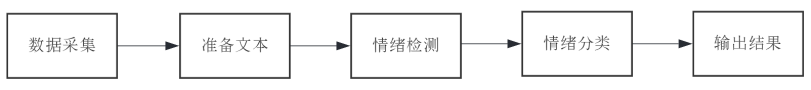

<h4 align="center">Fig. 1: The main steps of text sentiment polarity classification<h4>

 

## Solution

In the experiment, Naive Bayes, Convolutional Neural Network and Logistic Regression were used to classify sentiment polarity of Chinese text. Although Naive Bayes is a relatively traditional and simple classification method, the performance of the constructed model is quite high. The accuracy of the training samples can reach 1.00, and the accuracy of the test samples can reach 0.77. Therefore, Naive Bayes It is still widely used in the classification task of text sentiment polarity.

 For more complex model such as convolutional neural network , after iterative optimization of parameters, the average accuracy of training samples and test samples can reach 0.91. For logistic regression, the model performance is not as good as the previous two models, where the training sample accuracy rate reaches 0.91, while the test sample accuracy rate is only 0.57. 

The reason why the convolutional neural network can train such a high-performance model in text sentiment polarity classification comes from the features extracted from the global information. The relationship between the features is considered through the data information in the features, and the data samples are analyzed and classified. The convolutional neural network in the experiment uses 3 layers of convolutional layers and pooling layers to connect to the fully connected layer. After each layer is extracted multiple times, the network parameters are updated through chain rule and backpropagation optimization, so that the sample labels have a higher probability of being correctly estimated at the output layer.

 

## Algorithm Explanation

<h3 style="color:grey">Naive Bayes Classifier</h3>

Bayesian network classifiers are probabilistic classifiers based on Bayes' theorem, which are commonly used in many supervised classification models, mainly considering the naive independence assumption. The advantage of Naive Bayes is that it can accurately classify the test set even when there is only a small training set, so Naive Bayes is often used in text classification, in which the algorithm is characterized by word frequency to classify texts . 

Naive Bayes is a conditional probability model. Although its principle is simple and hypothetical, Bayesian classifiers have so far been proven to be effective in many cases. The basic idea of Naive Bayes in text sentiment polarity classification is to calculate the category probability of a given text, and the joint probability of the text and category is used in the calculation process, and it is based on the assumption of word independence. For a given data vector x and category C, there is the following formula:
 
$$
P(C|x)=\dfrac{P(x|C)P(C)}{P(x)}
$$
 
Given a data vector $x=\{x_{1},x_{2},\cdots ,x_{i}\}$ , assuming that all elements of x are independently distributed in a given class, the probability of x can be estimated by the following formula: 
 
$$
P(C|x)=P(C) \cdot \prod P(x_{i}|C)
$$
 
  

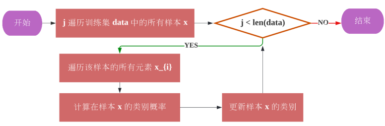

<h4 align="center">Fig. 2: Algorithm flowchart of text sentiment polarity classification based on Naive Bayes<h4>  

<h3 style="color:grey;">Convolutional Neural Network</h3>

For the traditional method such as Naive Bayes, the category of the sentence is judged based on all the word segmentations in the sentence. Given the independence of word segmentation, important information may be lost in the process of extracting keywords. When analyzing the sentiment polarity of text, the convolutional neural network can extract feature regions from the global information, and classify the data samples by considering the relationship between the features through the data information in the features. 

Figure 3 shows the CNN architecture with sentence sentiment polarity classification. The filter area sizes in the convolutional layer are 2, 3, and 4, and each area has 300 filters to convolve the sentence matrix and generate variable-length feature map. Afterwards, 1D max-pooling is performed on each feature map on the pooling layer, and 1D feature vectors are generated from all maps, and all 1D feature vectors are concatenated together to form a fully connected layer. The final softmax layer receives a feature vector as input and uses this feature vector to perform sentiment polarity classification on sentences.

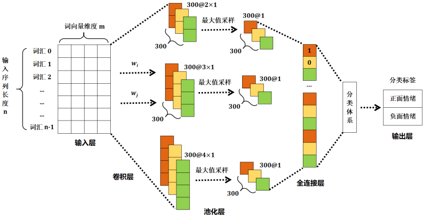

<h4 align="center">Fig. 3: CNN structure based on text sentiment polarity classification<h4>
 
  

 

 
| Layer                           | Layer Name                                   | Kernel Size        | Output Size                                                                  |
| :-----------------------------: | :------------------------------------------: | :----------------: | :-------------------------------------------------------------------------: |
| Input layer                     | Input                                        | -                  | 16×300×500                                                                  |
| Convolutional layer ( 3 times ) | Conv1D ReLU  MaxPool1  DFlatten     | 2×2 - - - | 64×300×500 64×300×500 64×300×1 64×300 |
|                                 | Conv1D  ReLU  MaxPool1  DFlatten    | 3×3 - - - | 64×300×500 64×300×500 64×300×1 64×300 |
|                                 | Conv1D  ReLU  MaxPool1  DFlatten | 4×4 - - - | 64×300×500 64×300×500 64×300×1 64×300 |
| Fully Connected Layer           | Fully Connected  dropout  Softmax      | - - -        | 64×900 64×900 64×2                                                    |
| Output layer                    | Output                                       | -                  | 1                                                                            |

 

<h4 align="center">Table 1: Convolutional Neural Network Model Structure<h4>

 

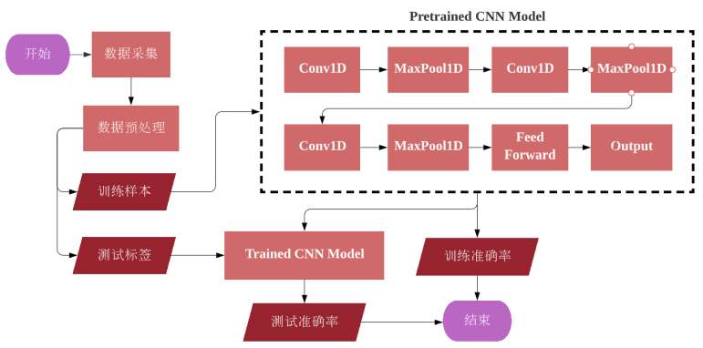

<h4 align="center">Fig. 4: Algorithm Flowchart of text sentiment polarity classification based on CNN<h4>

 

<h3 style="color:grey;">Logistic Regression</h3>

Logistic regression is a machine learning algorithm that uses a logistic function to model variables that depend on categories and predict their probabilities. The algorithm is essentially dichotomous, that is, logistic regression can only divide data samples into two categories. Logistic regression is easy to implement and performs well on linearly classifiable classes. 

First, the data sample is defined as the algorithm definition, and a set of weight vectors W are defined for the model. In the process of model learning, the weight vector is continuously optimized and updated to improve the accuracy of the model's prediction data. Among them, the process of continuously adjusting the value of the weight vector $W$ is called learning. Take the dot product of weights and features $W \cdot X$ for all input samples as the net input, and convert the net input into a real number within [0, 1] through the Sigmoid function . This real number can also be expressed as the probability that the sample belongs to the positive category. The sigmoid function $(3)$ converts large net input values to values close to 1 and small net input values to values close to 0.
 
$$
\sigma (x)=\dfrac{1}{1+e^{-x}}
$$
 
The predicted values are mapped to probabilities using the sigmoid function for all training samples, which are used to compare the actual and predicted labels and calculate the error and loss. The loss function is used to measure the degree to which the model misestimates the predicted and actual labels. For logistic regression, the loss function $(4)$ is given by the formula, where $h(x)$ is the estimated label ( $y_{predict}$ ). 

Logistic regression uses gradient descent to compute the minimum of a function with the goal of minimizing loss and error. To find the minimum value of a function, calculate the gradient of the function at a certain point and move it in a direction that reduces the function. The learning rate is a hyperparameter of the model, which is the iterative step size in the gradient descent algorithm. If the learning rate is too small, the model may fall into a local minimum, and if the learning rate is too large, the model may skip the global minimum. small value. Therefore, in the process of training the model, the learning rate needs to be adjusted for the data set so that the model can achieve optimal performance.
 
$$
cost(h(x),y_{actual})=
\begin{cases}
\ \ \ -log(h(x))\ \ \ ,\ \ \ y=1\\
-log(1-h(x))\ ,\ \ \ y=0
\end{cases}
$$

  
 

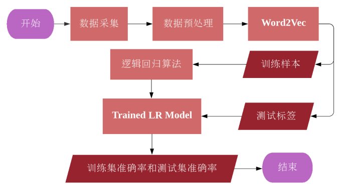

<h4 align="center">Fig. 5: Algorithm Flowchart of text sentiment polarity classification based on logistic regression<h4>

 

## Environmental Setup

**Experimental environment :**  Visual Studio Code 1.67.1 + Python 3.6.8

**Experimental data :**  sentiment dictionary, sentiment annotation prediction and dataset provided

**Experimental parameters :**  500 positive and negative emotional sentences each, with a total data volume of 1000

 

## Result

| Naive Bayes             | 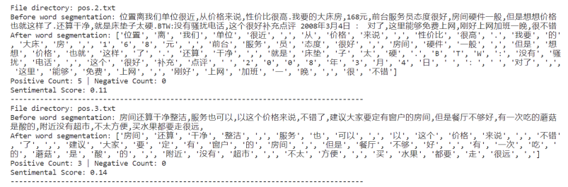 |
| :---------------------: | ------------------------------------------------------------ |
|                         | 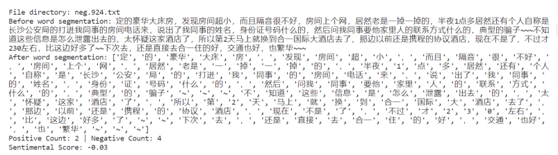 |
|                         | 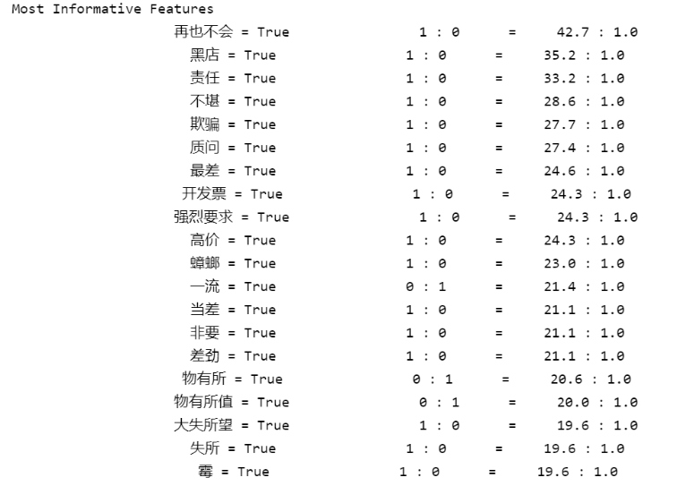 |
|                         | 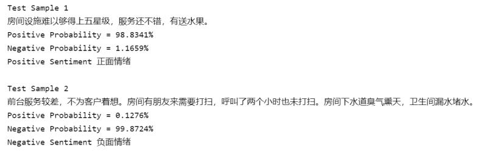 |
| **CNN**                 | 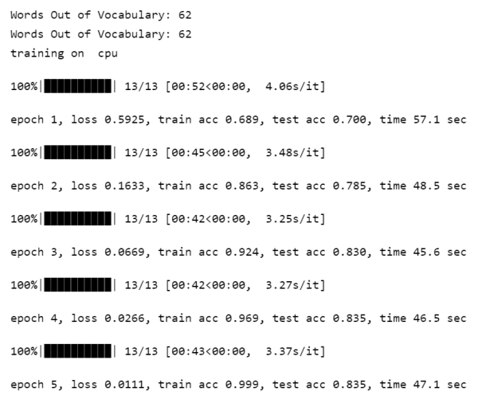 |
|                         | 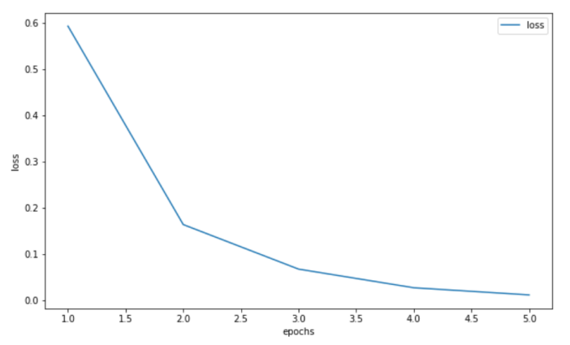 |
|                         | 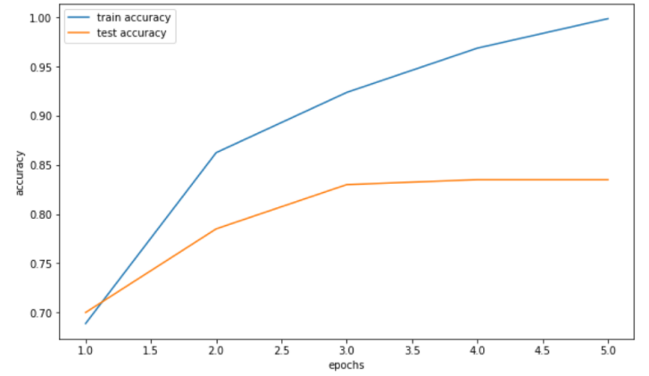 |
| **Logistic Regression** | 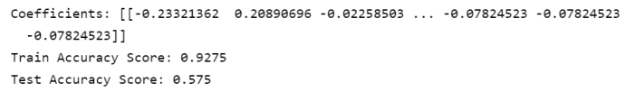 |
|                         | 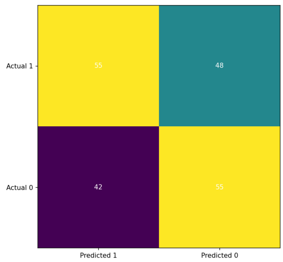 |
|                         | 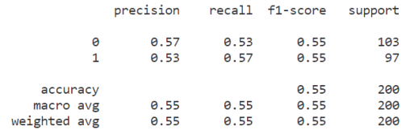 |

<h4 align="center">Table 2: Result of text sentiment polarity classification<h4>

 

## Analysis

The three algorithms in the experiment, Naive Bayes, Convolutional Neural Network and Logistic Regression, use the same data samples, that is, 500 positive and negative emotional sentences, and the total number of samples is 1000. According to the figure shown in Table 2, the training sample accuracy of the Naive Bayes model is 0.91, and the test sample accuracy is 0.69; the training of the convolutional neural network model The sample accuracy is 0.99 and the test sample accuracy is 0.85; the logistic regression model has a training sample accuracy of 0.93 and a test sample accuracy of 0.57. For the Chinese text sentiment polarity classification problem in this experiment, the convolutional neural network model performed the best among the three models.

The reason why the convolutional neural network can train such a high-performance model in text sentiment polarity classification comes from the features extracted from the global information, the relationship between the features is considered through the data information in the features, and the data samples are analyzed. Classification. The convolutional neural network in the experiment uses 3 layers of convolutional layers and pooling layers to connect to the fully connected layer. After each layer is extracted multiple times, the network parameters are updated through chain rule and backpropagation optimization, so that the sample The labels have a higher probability of being correctly estimated at the output layer.

 

## Personal Summary

From this experiment, I learned how to use algorithms such as Naive Bayes, Convolutional Neural Networks, and Logistic Regression to classify sentiment polarity of Chinese texts , and gained a preliminary understanding of the field of natural language processing. On the other hand, I am deeply aware that in today's era of globalization and networking, it is a very valuable operation to analyze online texts and obtain social data through natural language technology. Natural language processing can analyze the emotional polarity of social groups at a deeper level, not just on the surface of words, so the development of natural language processing has great potential in the future.

